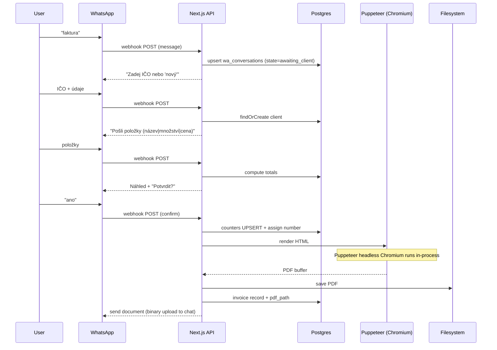

# User Flow Diagram (Mermaid)

```mermaid
sequenceDiagram
  participant U as User
  participant W as WhatsApp
  participant API as Next.js API
  participant DB as Postgres
  participant PDF as Puppeteer (Chromium)
  participant FS as Filesystem

  U->>W: "faktura"
  W->>API: webhook POST (message)
  API->>DB: upsert wa_conversations (state=awaiting_client)
  API-->>W: "Zadej IČO nebo 'nový'"
  U->>W: IČO + údaje
  W->>API: webhook POST
  API->>DB: findOrCreate client
  API-->>W: "Pošli položky (název|množství|cena)"
  U->>W: položky
  W->>API: webhook POST
  API->>DB: compute totals
  API-->>W: Náhled + "Potvrdit?"
  U->>W: "ano"
  W->>API: webhook POST (confirm)
  API->>DB: counters UPSERT + assign number
  API->>PDF: render HTML
  Note over PDF: Puppeteer headless Chromium runs in-process
  PDF-->>API: PDF buffer
  API->>FS: save PDF
  API->>DB: invoice record + pdf_path
  API-->>W: send document (binary upload to chat)
```
